## Aviato DDD

### Opis sistema
Glavni domen sistema je rezervisanje letova kao i pracenje load-a aviona pa su i glavni fokus klase:
- Booking
- Flight

Pored toga imamo i putnika (Customer) za koji se neka rezervacija vezuje i koji ima tip odnosno moze da bude muskrac, zena ili dete  
pa cemo tako moci da pratimo opterecenost aviona po tim kategorijama. To nije jedino po cemu cemo moci da pratimo opterecenost aviona, moci  
cemo da pratimo i po klasi (Ekonomska, bzinis, prva)  
Fokus biznis logike je kreiranje ponude za za rezervaciju gde se uzima u obizr klasa, tip putnika kao i i vreme koliko je ostalo do samog leta  
i na osnovu toga se kreira cena za tu rezervaciju, ukoliko korisnik potvrdi rezervaciju on dobija odredjene poene, koje kasnije moze da iskoristi kako bi   
dobio jeftiniju kartu

### Grubi UML dijagram

```mermaid
classDiagram
    Customer --o Booking
    Flight --|> Airplane
    Flight --o Booking
    Booking ..> Airplane
    
    class ClassType {
        <<enumeration>>
        ECONOMY
        BUSINESS
        FIRST
    }
    
    class BookingStatus {
        <<enumeration>>
        OFFER
        CONFIRMED
    }

    class CustomerType {
        <<enumeration>>
        MALE
        FEMALE
        CHILD
    }
    
    class ICustomerRepository {
        <<interface>>
        +getCustomerById(id: int): Customer
        +saveCustomer(customer: Customer): void
    }
    
    class IFlightRepository {
        <<interface>>
        +getFlightById(id: int): Flight
        +saveFlight(flight: Flight): void
    }
    
    class IBookingRepository {
        <<interface>>
        +getBookingById(id: int): Booking
        +saveBooking(booking: Booking): void
        +getBookingsByFlightAndClass(flight: Flight, class: ClassType): List<Booking>
    }
    
    class IBookingService {
        +calculatePrice(flight: Flight, class: ClassType): float
        +createBooking(customer: Customer, flight: Flight, class: ClassType): Booking
        +getLoadFactor(flight: Flight, class: ClassType): float
        +updateBookingStatus(booking: Booking, status: BookingStatus): void
    }
    
    class Customer {
        <<Entity>>
        +id: int
        +name: string
        +customerType: customerType
        +points: int
        +bookings: list<Booking>
    }
    
    class Flight {
        <<Entity>>
        +id: int
        +departureAirport: string
        +arrivalAirport: string
        +date: DateTime
        +airplane: Airplane
        +bookings: List<Booking>
    }
    
    class Airplane {
        <<Entity>>
        +id: int
        +name: string
        +economySeats: int
        +businessSeats: int
        +firstClassSeats: int
    }
    
    class Booking {
        <<Entity>>
        +id: int
        +customer: Customer
        +flight: Flight
        +class: ClassType
        +price: float
        +status: BookingStatus
    }
    
    class BookingService {
        <<Service>>
        -bookingRepo: IBookingRepository
        -flightRepo: IFlightRepository
        +createBookingOffer(flight: Flight, class: ClassType, customer: Customer): Booking
        +confirmBooking(booking: Booking): Booking
    }
    
    class CustomerRepository {
        <<Repository>>
        -customers: Map<int, Customer>
        +getCustomerById(id: int): Customer
        +saveCustomer(customer: Customer): void
    }
    
    class FlightRepository {
        <<Repository>>
        -flights: Map<int, Flight>
        +getFlightById(id: int): Flight
        +saveFlight(flight: Flight): void
    }
    
    class BookingRepository {
        <<Repository>>
        -bookings: Map<int, Booking>
        +getBookingById(id: int): Booking
        +saveBooking(booking: Booking): void
        +getByFlight(flight: Flight): List<Booking>
    }

    class FlightService {
        +getLoadFactor(flight: Flight): LoadFactor
    }
    
    CustomerRepository <|-- ICustomerRepository : implements
    FlightRepository <|-- IFlightRepository : implements
    BookingRepository <|-- IBookingRepository : implements
    
    BookingService <|-- IBookingService : implements
    BookingService ..> BookingRepository : depends on
    BookingService ..> CustomerRepository : depends on

    FlightService ..> FlightRepository : depends on

```

