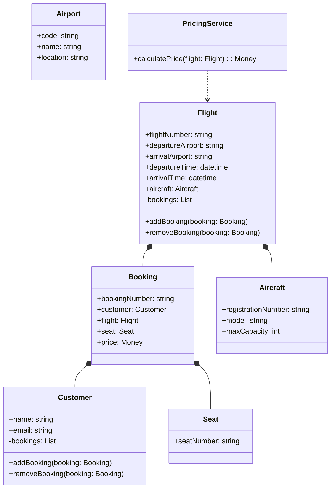

## Aviato DDD skica

```mermaid
classDiagram
  class Flight {
    +flightNumber: string
    +departureAirport: string
    +arrivalAirport: string
    +departureTime: datetime
    +arrivalTime: datetime
    +aircraft: Aircraft
    -bookings: List<Booking>
    +addBooking(booking: Booking)
    +removeBooking(booking: Booking)
  }

  class Booking {
    +bookingNumber: string
    +customer: Customer
    +flight: Flight
    +seat: Seat
    +price: Money
  }

  class Customer {
    +name: string
    +email: string
    -bookings: List<Booking>
    +addBooking(booking: Booking)
    +removeBooking(booking: Booking)
  }

  class Seat {
    +seatNumber: string
  }

  class Aircraft {
    +registrationNumber: string
    +model: string
    +maxCapacity: int
  }

  class Airport {
    +code: string
    +name: string
    +location: string
  }

  class PricingService {
    +calculatePrice(flight: Flight): Money
  }

  Flight *-- Aircraft
  Flight *-- Booking
  Booking *-- Customer
  Booking *-- Seat
  PricingService ..> Flight
```
